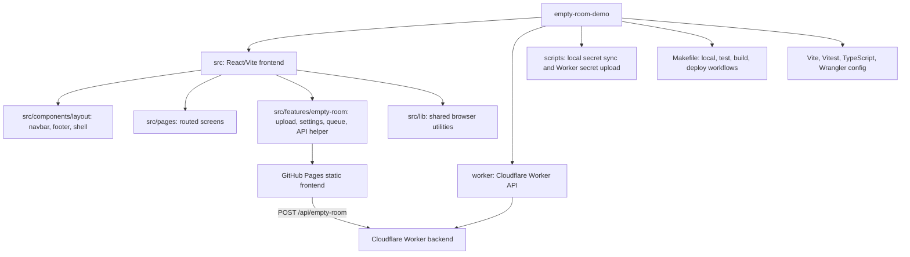

# Empty Room Demo 🏠

A small Vite, React, Tailwind CSS, and Cloudflare Worker demo for uploading room photos and asking OpenAI image models to remove furniture and loose objects.

The browser app is static and safe to host publicly. The OpenAI API key stays in the Cloudflare Worker, so it is never bundled into the frontend. 🔐

## Local Setup 🚀

1. Install dependencies:

```sh
npm install
```

2. Create `.env.local` with your OpenAI key:

```sh
OPENAI_API_KEY=your_key_here
```

3. Start the frontend and Worker together:

```sh
make up
```

Open `http://127.0.0.1:5173/#/`. The about page is at `http://127.0.0.1:5173/#/about`.

## Make Commands ✅

| Command | What it does |
| --- | --- |
| `make help` | Prints the available Make targets. |
| `make up` | Starts the Vite frontend and local Cloudflare Worker. |
| `make up-frontend` | Starts only the Vite frontend, pointing at `LOCAL_WORKER_URL`. |
| `make up-backend` | Starts only the Worker and syncs `.env.local` into `.dev.vars`. |
| `make kill` | Stops both local dev servers. |
| `make kill-frontend` | Stops only Vite. |
| `make kill-backend` | Stops only Wrangler. |
| `make test` | Runs frontend and backend unit tests. |
| `make test-frontend` | Runs tests under `src`. |
| `make test-backend` | Runs tests under `worker`. |
| `make check` | Runs full non-regression checks for frontend and backend. |
| `make check-frontend` | Runs frontend tests and a production frontend build. |
| `make check-backend` | Runs backend tests, backend typecheck, and Worker dry-run deploy. |
| `make build` | Builds/checks both sides. |
| `make build-frontend` | Typechecks and builds the static Vite app into `dist`. |
| `make build-backend` | Typechecks the Worker and runs Wrangler dry-run deploy. |
| `make worker-secret` | Uploads `OPENAI_API_KEY` from `.env.local` as a Worker secret. |
| `make worker_secret` | Same as `make worker-secret`, kept for compatibility. |
| `make deploy-backend` | Deploys only the Cloudflare Worker. |
| `make deploy-frontend WORKER_URL=https://...` | Builds and publishes only the GitHub Pages frontend. |
| `make deploy WORKER_URL=https://...` | Deploys the Worker, then publishes the frontend. |

Useful overrides:

| Variable | Default | Use |
| --- | --- | --- |
| `WORKER_URL` | empty | Required for frontend deploys so the static app calls the deployed Worker. |
| `GH_PAGES_BASE` | `/empty-room-demo/` | Vite base path for GitHub Pages builds. |
| `LOCAL_WORKER_URL` | `http://127.0.0.1:8787` | Local Worker URL used by `make up-frontend`. |
| `LOCAL_FRONTEND_URL` | `http://127.0.0.1:5173` | Local frontend URL shown by Make. |

## Project Structure 🧭



## Frontend Workflow

Use the targeted commands when only the browser app changed:

```sh
make test-frontend
make check-frontend
```

The frontend uses hash routing so GitHub Pages can serve the app without server-side route rewrites.

## Backend Workflow

Use the targeted commands when only the Worker changed:

```sh
make test-backend
make check-backend
```

`make check-backend` runs unit tests, TypeScript validation, and `wrangler deploy --dry-run --config wrangler.jsonc`.

## Deployment 🌍

1. Log in to Cloudflare:

```sh
npx wrangler login
```

2. Upload the Worker secret:

```sh
make worker-secret
```

3. Deploy the Worker and GitHub Pages frontend:

```sh
make deploy WORKER_URL=https://empty-room-demo-api.<your-subdomain>.workers.dev
```

To deploy only one side:

```sh
make deploy-backend
make deploy-frontend WORKER_URL=https://empty-room-demo-api.<your-subdomain>.workers.dev
```

## Testing Policy 🧪

Add or update unit tests whenever you add behavior. Use targeted tests while working, then run `make check` before shipping changes.
